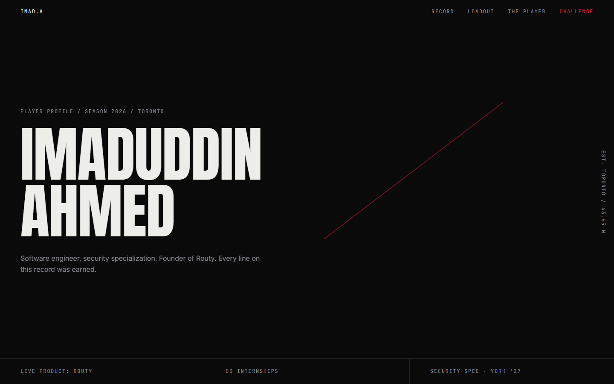

# RANK ONE

The portfolio of Imaduddin Ahmed, structured as the profile of a top-ranked player.
Career as match record, skills as loadout, contact as a challenge.



**Live:** https://imaduddin-ahmed.vercel.app

## The cut

One signature mechanic, built once and reused everywhere:

1. **The slash.** Swipe fast across the hero and a straight 1px seal line draws along
   your vector, shears the name 2px along the cut, holds, and fades. Vanilla canvas
   painted from the GSAP ticker, three cuts max, 60fps under 4x CPU throttle.
2. **Loading sequence.** First visit per session: the line draws, the name snaps in with
   no fade, the screen splits along the line to reveal the hero. Under one second.
3. **Route transitions.** The same split between `/` and case studies. Clip-path polygons
   driven by a GSAP timeline, under 0.7s, interruptible, never queued.
4. **Mobile menu.** The overlay wipes open from the diagonal.
5. **Ghost numerals.** Each section's outlined index numeral reveals with the same
   diagonal wipe as it enters the viewport.

Everything else stays quiet. `prefers-reduced-motion` turns every reveal opacity-only,
turns the cut into a plain fade, disables Lenis, and mounts no slash canvas.

## Design tokens

All tokens live in [`src/index.css`](src/index.css) as the entire Tailwind theme.
Tailwind's default palette is wiped (`--color-*: initial`), so an off-palette utility
class does not compile. GSAP reads the motion tokens out of the stylesheet at startup
(`src/lib/motion.js`), so CSS and JS animate with the same curves by construction.

### Color, six values

| Token        | Hex       | Use                                     |
| ------------ | --------- | --------------------------------------- |
| `--ink`      | `#0A0A0B` | Page background                         |
| `--ash`      | `#141416` | Raised surfaces (command palette)       |
| `--hairline` | `#232327` | All borders, 1px, always                |
| `--steel`    | `#8A8A93` | Secondary text, labels                  |
| `--bone`     | `#EDEDE9` | Primary text                            |
| `--seal`     | `#C81E2E` | The only accent. Cuts, active states, the challenge. Under 2% of any viewport |

### Type, three faces

| Face           | Job                          | Treatment                                  |
| -------------- | ---------------------------- | ------------------------------------------ |
| Anton          | Display, headings, the name  | Caps, line-height 0.95, tight tracking     |
| Inter          | Body                         | Normal case, 16px, line-height 1.6         |
| JetBrains Mono | Labels, stats, nav, metadata | Caps, letter-spacing 0.14em, tabular nums  |

Scale: `12 / 16 / 24 / 40 / clamp(64px, 10vw, 140px)`. Big jumps, no in-between sizes.

Anton is self-hosted from `public/fonts/` so `index.html` can preload it by a stable URL;
Inter and JetBrains Mono ship via fontsource, latin subsets only, `font-display: swap`.

### Motion

| Token           | Value                            | Use                     |
| --------------- | -------------------------------- | ----------------------- |
| `--ease-cut`    | `cubic-bezier(0.83, 0, 0.17, 1)` | The cut, decisive       |
| `--ease-settle` | `cubic-bezier(0.22, 1, 0.36, 1)` | Everything else, calm   |
| `--t-fast`      | `0.2s`                           | Hovers                  |
| `--t-base`      | `0.4s`                           | Reveals                 |
| `--t-cut`       | `0.7s`                           | Page transitions, total |

Motion system: GSAP + ScrollTrigger + Lenis (lerp 0.1). Nothing else.

## Stack

React 19, Vite, Tailwind CSS 4, GSAP, Lenis, React Router. Deployed on Vercel.

## Running locally

```bash
npm install
npm run dev        # dev server
npm run build      # production build to dist/
npm run preview    # serve the production build
```

Against a running `npm run preview`: `node scripts/screenshot.mjs` regenerates the hero
screenshot (captured mid-cut), `node scripts/trace-slash.mjs` reports slash frame timings
under CPU throttle, and `node scripts/make-placeholders.mjs` regenerates the MEDIA
PENDING placeholders in `public/media/`. Real product media replaces the placeholders by
filename, no code changes.

## Engineer details

- `Cmd+K` / `Ctrl+K` opens the command palette: jump to sections, copy email, open GitHub, open resume.
- Clicking the email copies it; the label flips to `COPIED` for 1.2s. No toast.
- Typing `gg` outside inputs opens the challenge through the cut.

## Performance

Lighthouse (mobile emulation, simulated slow 4G, production build): performance 95,
accessibility 100. Total JS 139 kB gzipped against a 250 kB budget. The hero is served
as a static shell in `index.html` (kept in sync with `Hero.jsx`) so the largest paint
does not wait for the bundle. The slash mechanic holds 60fps at 4x CPU throttle
(p95 frame 16.7ms, zero frames over 25ms).
